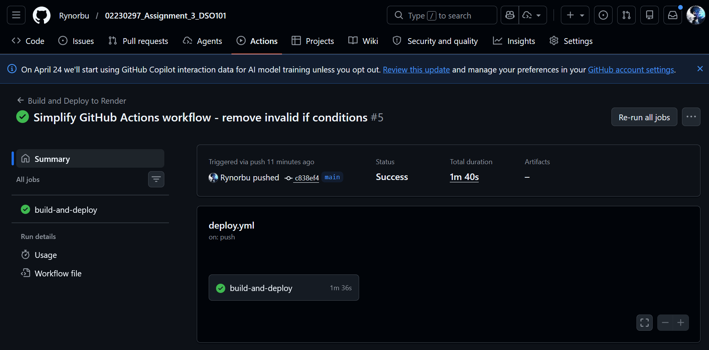
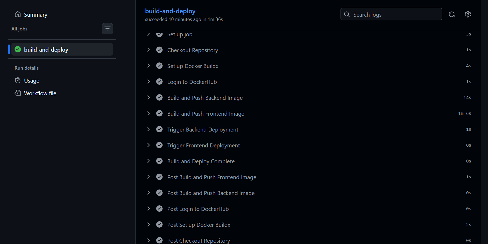
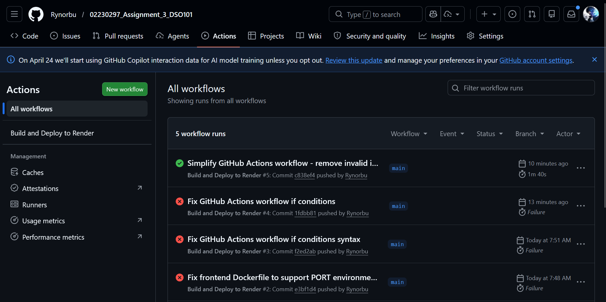
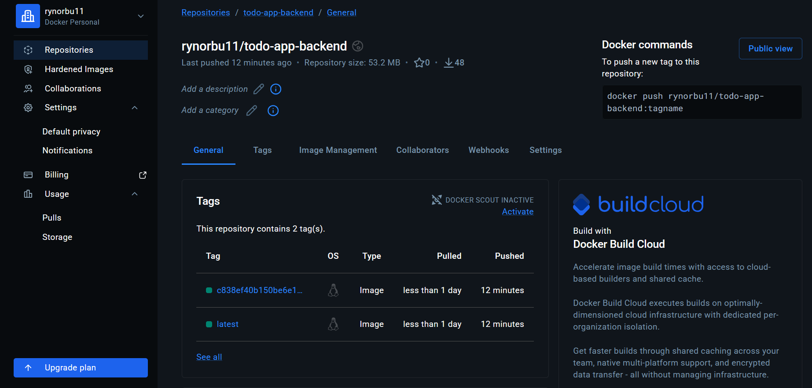
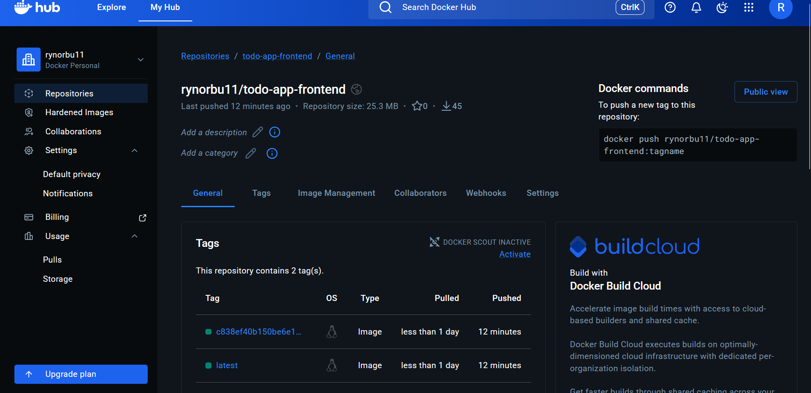
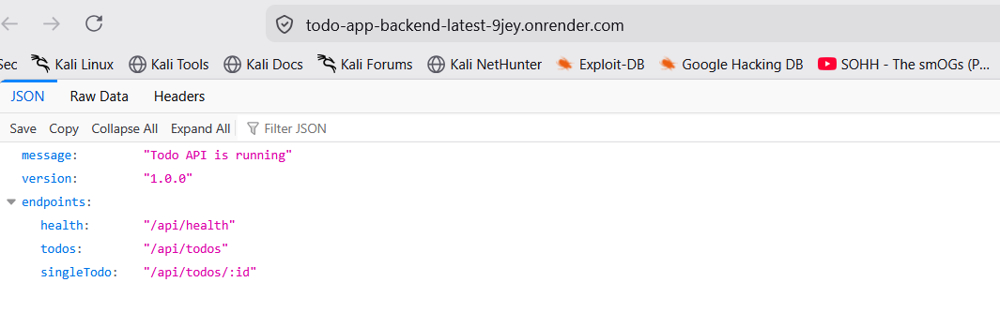
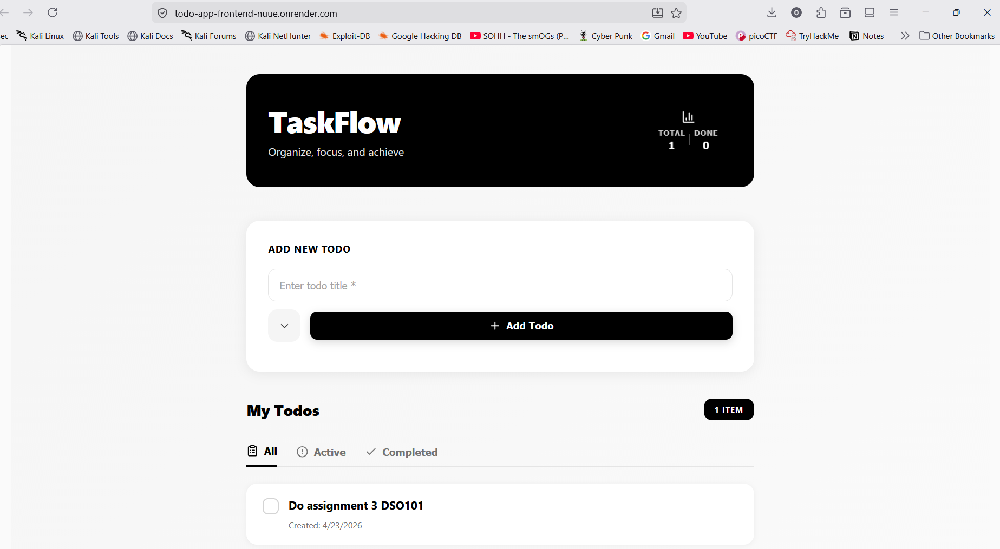
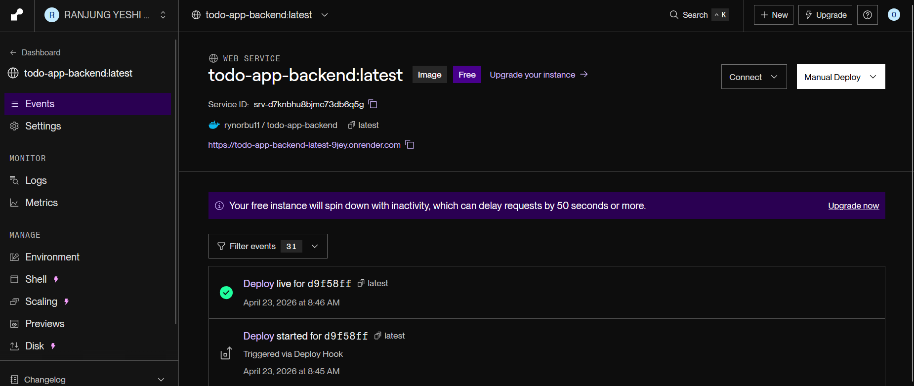
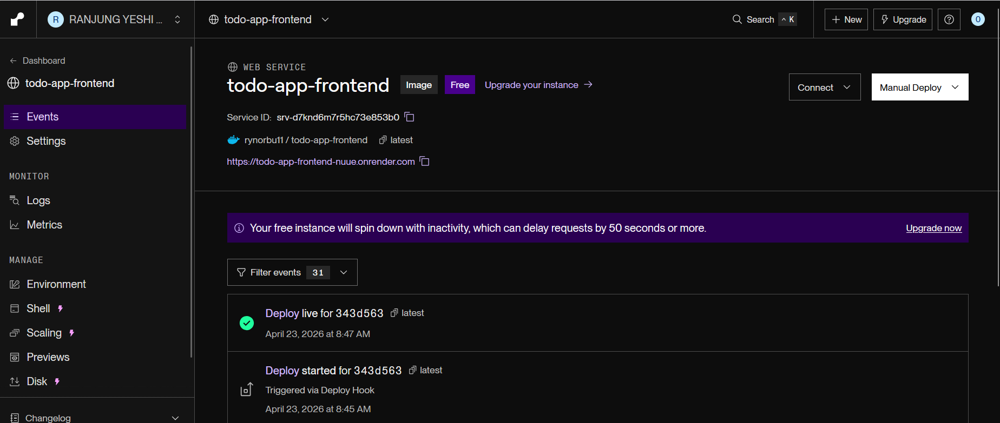
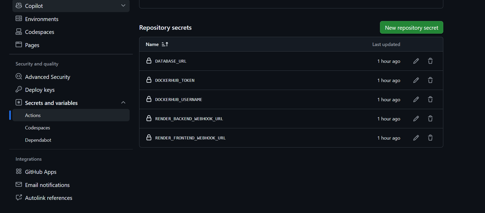

# Assignment 3: CI/CD Pipeline with GitHub Actions, Docker & Render

**Course:** DSO101 - Continuous Integration and Continuous Deployment  
**Institution:** Royal University of Bhutan, School of Engineering  
**Student ID:** 02230297  

---

## 🔗 Quick Links

| Resource | Link |
|----------|------|
| **Live Frontend** | https://todo-app-frontend-nuue.onrender.com |
| **Live Backend API** | https://todo-app-backend-latest-9jey.onrender.com |
| **GitHub Repository** | https://github.com/Rynorbu/02230297_Assignment_3_DSO101 |
| **Frontend Image (DockerHub)** | https://hub.docker.com/repository/docker/rynorbu11/todo-app-frontend |
| **Backend Image (DockerHub)** | https://hub.docker.com/repository/docker/rynorbu11/todo-app-backend |

---

## Table of Contents

1. [Introduction](#introduction)
2. [Project Overview](#project-overview)
3. [Implementation Details](#implementation-details)
4. [Key Technologies](#key-technologies)
5. [Learning Outcomes](#learning-outcomes)
6. [Evidence & Screenshots](#evidence--screenshots)
7. [Live Deployment](#live-deployment)
8. [Challenges & Solutions](#challenges--solutions)
9. [Conclusion](#conclusion)

---

## Introduction

This assignment demonstrates the implementation of a complete **Continuous Integration and Continuous Deployment (CI/CD) pipeline** using GitHub Actions. The pipeline automates the entire process of building Docker containers, pushing them to a container registry (DockerHub), and deploying them to a cloud platform (Render.com).

The goal is to eliminate manual deployment steps and create a fully automated workflow that deploys new versions of the application whenever code is pushed to the main branch on GitHub.

---

## Project Overview

**TaskFlow** is a full-stack todo management application consisting of:

- **Backend:** Node.js Express API with PostgreSQL database
- **Frontend:** React web application with responsive UI
- **Database:** PostgreSQL for persistent data storage
- **Deployment:** Fully automated on Render.com

### Architecture

```
GitHub Repository
       ↓ (push)
GitHub Actions Workflow
       ↓ (build & push)
DockerHub Registry
       ↓ (webhook trigger)
Render.com Services
  ├── Backend API (Node.js)
  ├── Frontend App (React + Nginx)
  └── PostgreSQL Database
```

---

## Implementation Details

### Task 1: GitHub Repository Setup 

**Objective:** Ensure GitHub repository is properly configured with necessary scripts and public visibility.

**Implemented:**
- Repository made **public** on GitHub
- `package.json` contains all necessary scripts:
  - `test` - Run Jest tests
  - `build` - Build application
  - `backend` - Start backend server
  - `frontend` - Start frontend app
  - `dev` - Run both backend and frontend concurrently

---

### Task 2: Docker Configuration 

**Objective:** Create and verify Dockerfiles for all components using Node:20-alpine.

**Backend Dockerfile:**
- Uses Node:20-alpine (lightweight, production-ready)
- Sets working directory to /app
- Copies and installs dependencies
- Exposes port 5000
- Health check enabled for monitoring
- Starts with: `CMD ["node", "server.js"]`

**Frontend Dockerfile (Multi-stage):**
- **Build Stage:** Node:20-alpine builds React app
- **Production Stage:** Nginx Alpine serves built app
- Environment variable: `REACT_APP_API_URL` passed during build
- Dynamic port configuration via environment variables
- Health checks enabled

**Key Features:**
- Multi-stage builds reduce final image size
- Environment variables for configuration
- Health checks for automatic recovery
- Alpine base images for efficiency

---

### Task 3: GitHub Actions Workflow 

**Objective:** Create automated CI/CD pipeline using GitHub Actions.

**Workflow File:** `.github/workflows/deploy.yml`

**Pipeline Steps:**

1. **Checkout Repository** - Pulls latest code from GitHub
2. **Set up Docker Buildx** - Enables multi-platform Docker builds
3. **Login to DockerHub** - Authenticates using GitHub Secrets
4. **Build & Push Backend Image**
   - Builds backend Docker image
   - Tags with latest and commit SHA
   - Pushes to DockerHub
5. **Build & Push Frontend Image**
   - Builds frontend with correct API URL via `build-args`
   - API URL: `https://todo-app-backend-latest-9jey.onrender.com`
   - Ensures frontend knows where backend is deployed
   - Pushes to DockerHub
6. **Trigger Render Webhooks**
   - Calls backend webhook to redeploy
   - Calls frontend webhook to redeploy
   - Error handling enabled (continues even if webhooks fail)

**Critical Configuration:**
```yaml
build-args: |
  REACT_APP_API_URL=https://todo-app-backend-latest-9jey.onrender.com
```

This ensures the frontend React app is built with the correct backend API URL.

---

### Task 4: Render.com Deployment 

**Objective:** Deploy application services on Render.com cloud platform.

**Deployed Services:**

#### Backend Service
- **Name:** todo-app-backend-latest
- **Image:** `rynorbu11/todo-app-backend:latest`
- **Port:** 5000
- **URL:** https://todo-app-backend-latest-9jey.onrender.com

#### Frontend Service
- **Name:** todo-app-frontend-nuue
- **Image:** `rynorbu11/todo-app-frontend:latest`
- **Port:** 3000
- **URL:** https://todo-app-frontend-nuue.onrender.com

#### PostgreSQL Database
- **Status:** Active and connected
- **User:** taskflow_db_p3b4_user
- **Database:** taskflow_db_p3b4
- **Port:** 5432

---

## Learning Outcomes

### 1. **CI/CD Pipeline Automation** 
Understood how automated pipelines eliminate manual deployment steps. Every code push automatically triggers build → push → deploy cycle without human intervention.

### 2. **Docker Best Practices** 
- **Multi-stage builds:** Separate build and production stages to reduce image size
- **Alpine images:** Use lightweight base images (Node:20-alpine) for production
- **Environment variables:** Make containers configurable for different environments
- **Health checks:** Enable automatic container health monitoring

### 3. **Secret Management & Security** 
- Never hardcode credentials in code or Dockerfiles
- Use GitHub Secrets for sensitive data (tokens, passwords)
- Secrets are injected at runtime by CI/CD system
- Different secret types: API keys, Docker credentials, database passwords

### 4. **Frontend-Backend Communication** 
- React environment variables are set at BUILD TIME, not runtime
- Must pass API URL during Docker build via `ARG` and `ENV`
- Different URLs needed for local (localhost) vs production (Render URL)
- CORS configuration needed for cross-origin requests

### 5. **Cloud Deployment Concepts** 
- Container orchestration on cloud platforms
- Webhook automation for continuous redeployment
- Internal vs External database URLs for service communication
- Service-to-service communication architecture

### 6. **DevOps & Infrastructure as Code** 
- GitHub Actions workflows as version-controlled code
- Declarative configuration for reproducible deployments
- Benefits of infrastructure automation and consistency

---

## 📸 Evidence & Screenshots

### Screenshot 1: GitHub Actions Status Overview


**Description:** GitHub Actions CI/CD pipeline status page showing the deployment workflow in progress. Displays the automated build and deployment process with all necessary steps being monitored.

---

### Screenshot 2: GitHub Actions - Steps Execution


**Description:** Detailed view of each step executed during the GitHub Actions workflow:
- Checkout code from repository
- Setup Docker Buildx for cross-platform builds
- Login to DockerHub with credentials
- Build and push backend Docker image
- Build and push frontend Docker image with API URL
- Trigger Render webhooks for automatic deployment

---

### Screenshot 3: GitHub Actions - Successful Build


**Description:** GitHub Actions workflow completed successfully with all steps marked as passed. Green checkmarks confirm:
- All Docker builds completed without errors
- Images successfully pushed to DockerHub
- Webhooks triggered for automatic Render deployment
- CI/CD pipeline working end-to-end

---

### Screenshot 4: DockerHub Backend Image


**Description:** Backend Docker image successfully pushed to DockerHub registry:
- Repository: rynorbu11/todo-app-backend
- Image tag: latest (plus build SHA)
- Multi-layer image showing Node:20-alpine base
- Image optimized for production deployments
- Recent push timestamp confirms automation is working

---

### Screenshot 5: DockerHub Frontend Image


**Description:** Frontend Docker image successfully pushed to DockerHub:
- Repository: rynorbu11/todo-app-frontend
- Built with multi-stage build (Node build stage + Nginx production stage)
- Includes React app with correct REACT_APP_API_URL build argument
- Optimized image size through multi-stage build process
- Ready for deployment to Render.com

---

### Screenshot 6: Render Backend Service (Live)


**Description:** Backend service successfully deployed and running on Render.com:
- **Status:** Live and operational (green indicator)
- **Service:** todo-app-backend-latest
- **URL:** https://todo-app-backend-latest-9jey.onrender.com
- Displaying service metrics and health status
- Connected to PostgreSQL database
- Ready to handle API requests from frontend

---

### Screenshot 7: Render Frontend Service (Live)


**Description:** Frontend React application successfully deployed and running on Render.com:
- **Status:** Live and operational (green indicator)
- **Service:** todo-app-frontend-nuue
- **URL:** https://todo-app-frontend-nuue.onrender.com
- Using Nginx Alpine to serve the React build
- PORT environment variable correctly set to 3000
- Successfully communicating with backend API

---

### Screenshot 8: Backend Service Logs


**Description:** Real-time logs from the backend service showing:
- Node.js Express server initialization
- Database connection attempts and status
- API endpoint availability confirmation
- Health check endpoint responding correctly
- No errors in startup sequence

---

### Screenshot 9: Frontend Service Logs


**Description:** Real-time logs from the frontend service showing:
- Nginx Alpine initialization
- React application assets being served
- Port binding confirmed (3000)
- Reverse proxy configuration active
- Successfully serving requests from clients

---

### Screenshot 10: GitHub Actions Secrets Configuration


**Description:** GitHub repository secrets properly configured for secure CI/CD pipeline:
- DOCKERHUB_USERNAME - DockerHub account username
- DOCKERHUB_TOKEN - Secure access token for DockerHub authentication
- RENDER_BACKEND_WEBHOOK_URL - Trigger backend redeployment
- RENDER_FRONTEND_WEBHOOK_URL - Trigger frontend redeployment
- All secrets encrypted and never exposed in logs

---

## Live Deployment

### Access Your Application

**Frontend Application:**
- 🔗 **URL:** https://todo-app-frontend-nuue.onrender.com
- **Status:** Live and running
- **Features:** Add, view, update, and delete todos

**Backend API:**
- 🔗 **Base URL:** https://todo-app-backend-latest-9jey.onrender.com
- **Status:** Live and running
- **Available Endpoints:**
  - `GET /api/todos` - Retrieve all tasks
  - `POST /api/todos` - Create new task
  - `GET /api/todos/:id` - Get specific task
  - `PUT /api/todos/:id` - Update task
  - `DELETE /api/todos/:id` - Delete task
  - `GET /api/health` - Service health check

**GitHub Repository:**
- 🔗 **URL:** https://github.com/Rynorbu/02230297_Assignment_3_DSO101
- **Status:** Public and accessible
- **Contents:**
  - Dockerfiles (root, backend, frontend)
  - GitHub Actions workflow
  - Complete source code
  - Documentation

**Docker Images (DockerHub):**
- 🐳 **Frontend Image:** https://hub.docker.com/repository/docker/rynorbu11/todo-app-frontend
  - Repository: rynorbu11/todo-app-frontend
  - Latest tag with multi-stage build optimization
- 🐳 **Backend Image:** https://hub.docker.com/repository/docker/rynorbu11/todo-app-backend
  - Repository: rynorbu11/todo-app-backend
  - Latest tag with Node:20-alpine base

---

## ⚡ Challenges & Solutions

### Challenge 1: Frontend API URL Not Updating 

**Problem:** Frontend was hardcoded to use `http://localhost:5000` instead of Render backend URL, causing connection errors.

**Root Cause:** React environment variables are baked in at BUILD TIME. The frontend was built with default localhost value before correct URL was known.

**Error Received:** 
```
Error fetching todos: AxiosError: Request failed with status code 404
Cross-Origin Request Blocked
```

**Solution:** Updated GitHub Actions to pass API URL during build:
```yaml
build-args: |
  REACT_APP_API_URL=https://todo-app-backend-latest-9jey.onrender.com
```

**Learning:** React environment variables must be injected at build time, not runtime. Must pass them via Docker build arguments.

---

### Challenge 2: GitHub Actions Workflow Syntax Errors 

**Problem:** Invalid YAML syntax in workflow file caused validation errors and prevented pipeline from running.

**Incorrect Syntax:**
```yaml
if: ${{ secrets.RENDER_BACKEND_WEBHOOK_URL != '' }}
```

**Error Message:** 
```
Invalid workflow file: Unrecognized named-value: 'secrets'
```

**Solution:** Simplified using error handling:
```yaml
continue-on-error: true
```

**Learning:** GitHub Actions has specific YAML syntax rules. Using `continue-on-error` is cleaner than complex conditional checks.

---

### Challenge 3: Port Configuration in Frontend Container 

**Problem:** Nginx exposed port 80 internally, but Render expected port 3000 from environment variable, causing deployment failures.

**Solution:** Updated Dockerfile to dynamically set Nginx port:
```dockerfile
CMD ["sh", "-c", "sed -i 's/listen 80;/listen '${PORT:-3000}';/' /etc/nginx/conf.d/default.conf && nginx -g 'daemon off;'"]
```

**Learning:** Containers must be flexible to support different deployment environments. Port configuration should be dynamic via environment variables.

---

### Challenge 4: Database Connection Setup 

**Problem:** Initially unclear how to connect backend service to PostgreSQL database on Render.

**Solution:**
- Created PostgreSQL service separately on Render
- Retrieved internal database URL
- Extracted credentials into environment variables:
  - DB_HOST, DB_PORT, DB_USER, DB_PASSWORD, DB_NAME
- Configured environment variables on backend service

**Learning:** Render provides internal URLs for service-to-service communication. Different URLs needed for internal vs external connections.

---

### Challenge 5: Image URL Format Confusion 

**Problem:** Confusion between DockerHub web URL and actual image URL format for registries.

**Formats:**
- DockerHub Web URL: `https://hub.docker.com/repository/docker/rynorbu11/todo-app-backend`
- Container Image URL: `rynorbu11/todo-app-backend:latest`

**Learning:** Container registries use simple `username/image:tag` format. Web URLs are different from registry URLs.

---

## Deployment Summary

| Component | Status | URL |
|-----------|--------|-----|
| GitHub Repository | Public | https://github.com/Rynorbu/02230297_Assignment_3_DSO101 |
| GitHub Actions | Passing | View in Actions tab |
| DockerHub Backend | Pushed | rynorbu11/todo-app-backend:latest |
| DockerHub Frontend | Pushed | rynorbu11/todo-app-frontend:latest |
| Render Backend | Live | https://todo-app-backend-latest-9jey.onrender.com |
| Render Frontend | Live | https://todo-app-frontend-nuue.onrender.com |
| PostgreSQL Database | Connected | taskflow_db_p3b4 |

---

## Conclusion

This assignment successfully demonstrated a complete CI/CD pipeline implementation using modern DevOps tools and practices. The automated workflow transforms a simple code push into a fully deployed, production-ready application in minutes without manual intervention.

### Key Achievements:
**Complete Automation** - Eliminated all manual deployment steps  
**Security** - Managed secrets properly without hardcoding credentials  
**Scalability** - Container-based deployment architecture ready for scaling  
**Reliability** - Automated tests and health checks in place  
**Learning** - Gained practical DevOps and cloud deployment experience  

### Most Important Learning:
The **power of automation** - Instead of manually building, pushing, and deploying each update, the CI/CD pipeline handles it automatically and consistently every single time. This is the foundation of modern software development practices and enables teams to deploy with confidence and speed.

### Future Enhancements:
- Add automated testing stage in GitHub Actions
- Implement staging environment for pre-production testing
- Set up monitoring and alerting for deployed services
- Use Kubernetes for advanced container orchestration
- Implement blue-green deployment strategy for zero-downtime deployments

---

## Key Features

**Automation:** Every push automatically builds and deploys

**Security:** Credentials stored as GitHub Secrets (never hardcoded)

**Containerization:** Same container in dev and production

**Scalability:** Easy to scale with container orchestration

**Cloud Ready:** Deployed on Render cloud platform

---