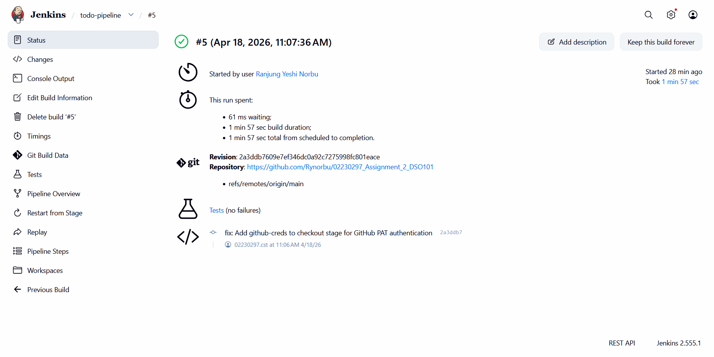
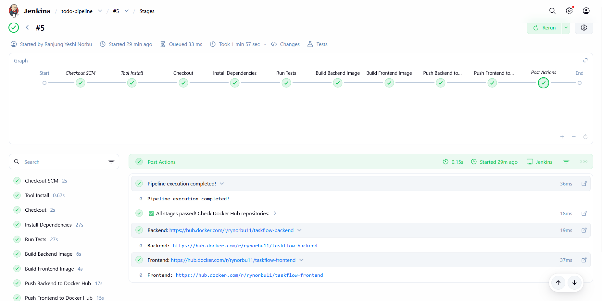
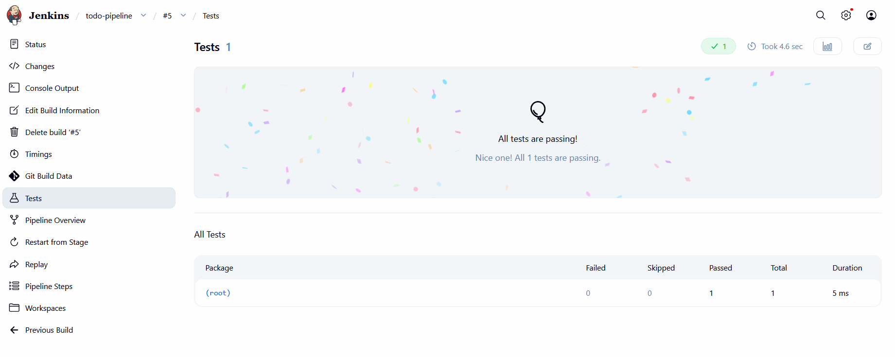
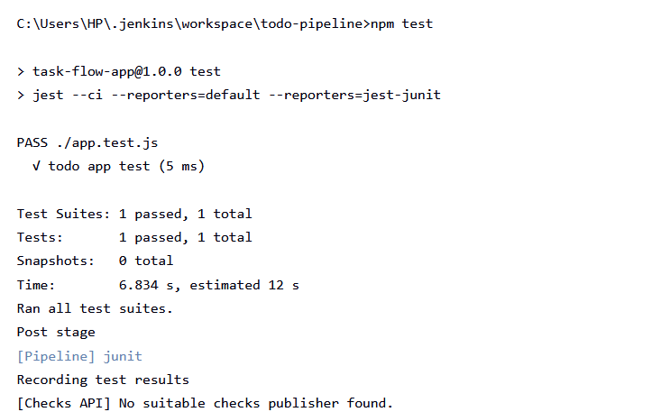
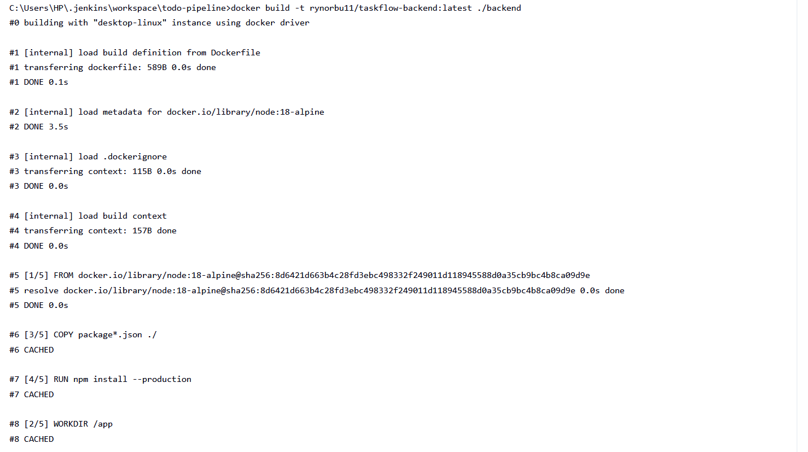
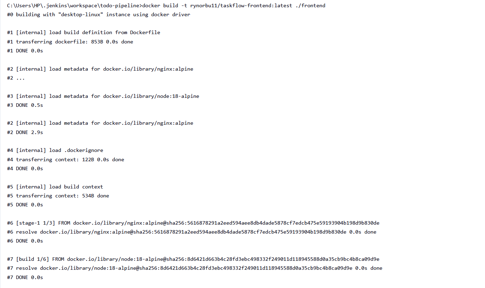
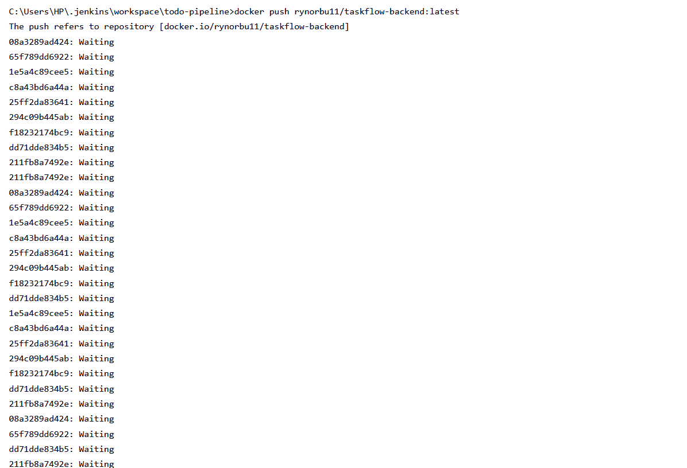
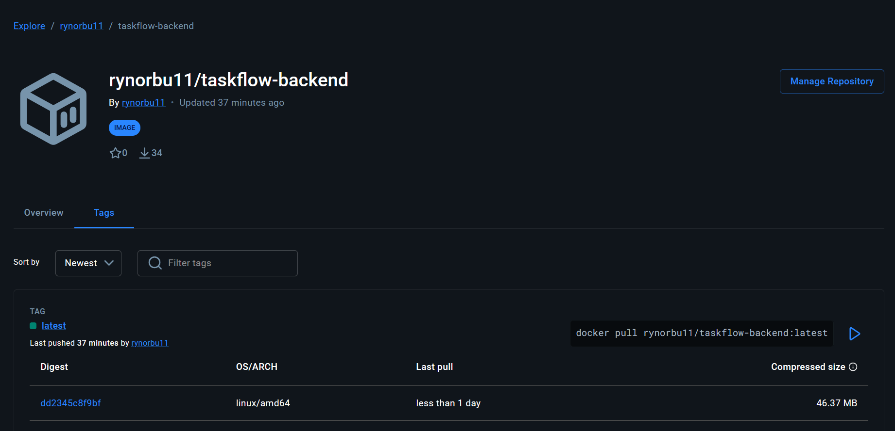
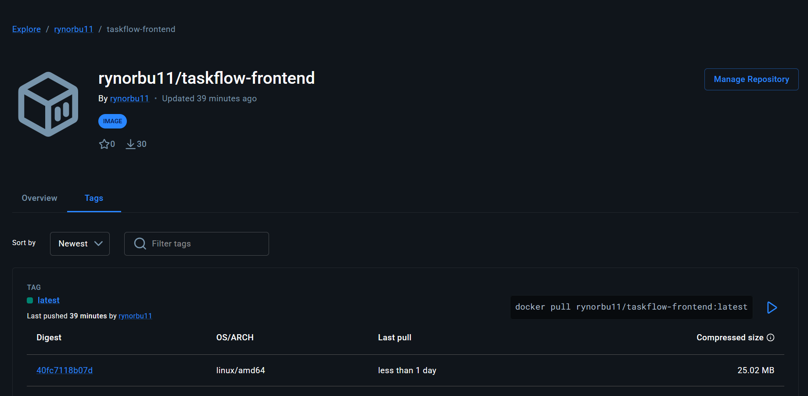

# Assignment 2: Continuous Integration and Continuous Deployment (DSO101)

## Executive Summary

This report documents the successful implementation of a Continuous Integration and Continuous Deployment (CI/CD) pipeline for the TaskFlow application using Jenkins. The pipeline automates the build, test, and delivery process, ensuring code quality and consistency. The application is containerized using Docker and deployed to Docker Hub for production use.

## Project Overview

TaskFlow is a modern, full-stack task management application with an automated CI/CD pipeline using Jenkins.

Technology Stack:
- Frontend: React 18.2.0 with dark theme user interface
- Backend: Node.js Express API with REST endpoints
- Database: PostgreSQL for data persistence
- CI/CD Platform: Jenkins with 7-stage automated pipeline
- Containerization: Docker and Docker Compose
- Image Registry: Docker Hub
- Version Control: GitHub
- Testing Framework: Jest with JUnit XML reporting

---

## Pipeline Configuration - Detailed Implementation

### Jenkins Setup and Configuration

The Jenkins environment was configured with the following specifications:

Tools Configured:
- NodeJS: Version 18 LTS installed and configured as global tool
- npm: Package manager for dependency management
- Docker: Installed on host machine for containerization
- Git: Default Git installation for repository access

Plugins Installed:
- Pipeline: For declarative pipeline support
- NodeJS Plugin: To manage multiple NodeJS versions
- Git Plugin: For GitHub repository integration
- GitHub Integration Plugin: For webhook support
- Docker Pipeline: For Docker command integration

### Seven-Stage Pipeline Architecture

The Jenkins pipeline executes seven sequential stages to automate the entire CI/CD workflow:

**Stage 1: Checkout**

This stage clones the source code from the GitHub repository on the main branch. It establishes connection using GitHub credentials and fetches the latest commit. The checkout ensures that Jenkins has the most recent code version before proceeding to build and test stages. Repository URL is configured as: **https://github.com/Rynorbu/02230297_Assignment_2_DSO101.git**

**Stage 2: Install Dependencies**

npm install command is executed to download and install all required Node.js packages defined in package.json files. This stage ensures that all project dependencies including Jest testing framework and jest-junit reporter are available before testing. The installation occurs at the root level to prepare the project environment.

**Stage 3: Run Tests**

The testing stage executes the Jest test suite with the command: **npm test**. This command runs Jest in continuous integration mode with two reporters: default console output and jest-junit for XML report generation. The JUnit XML report is automatically published to the Jenkins dashboard, making test results visible in the Jenkins UI. The test results are recorded and make the build fail if any tests fail.

**Stage 4: Build Backend Image**

Docker builds the backend container image using the Dockerfile in the ./backend directory. The image is tagged as rynorbu11/taskflow-backend:latest using the Docker Hub username. This stage compiles the Node.js Express application and prepares it for containerization. The Docker build context includes all backend source code and dependencies.

**Stage 5: Build Frontend Image**

Docker builds the frontend container image using the Dockerfile in the ./frontend directory. This is a multi-stage build that first compiles the React application and then serves it using Nginx. The image is tagged as rynorbu11/taskflow-frontend:latest. The frontend image contains the optimized production build of the React application.

**Stage 6: Push Backend to Docker Hub**

The backend image is authenticated using Docker Hub credentials stored securely in Jenkins and pushed to the Docker Hub repository. Docker login uses the credentials with the command: docker login -u username -p password. After successful authentication, the image is pushed to: **https://hub.docker.com/r/rynorbu11/taskflow-backend/tags**

**Stage 7: Push Frontend to Docker Hub**

Similarly, the frontend image is pushed to Docker Hub after authentication. The image is available at: **https://hub.docker.com/r/rynorbu11/taskflow-frontend/tags**

### **Testing Framework Implementation**

**Jest Configuration:**
- Jest Version: 29.5.0 - JavaScript testing framework
- jest-junit Version: 16.0.0 - JUnit XML report generator for Jenkins

**Test Command:**
```json
"test": "jest --ci --reporters=default --reporters=jest-junit"
```

**Command Flags:**
- `--ci`: Continuous Integration mode (optimized for Jenkins)
- `--reporters=default`: Console output for logs
- `--reporters=jest-junit`: Generates junit.xml for Jenkins dashboard

**Test File:**
- Location: app.test.js
- Current Test: Validates Jest framework integration
- Results: 1 test executed, 1 passed, 0 failed

**Test Execution Flow:**
1. Runs in "Run Tests" stage after dependencies install
2. Generates junit.xml report
3. Jenkins publishes results to dashboard
4. Failed tests block pipeline progression

### Docker Hub Deployment Strategy

The deployment utilizes separate Docker Hub repositories for independent scaling and management:

**Backend Repository:**

- Repository Name: taskflow-backend
- Image URL: **https://hub.docker.com/r/rynorbu11/taskflow-backend/tags**
- Tag: latest
- Purpose: Contains Node.js Express API
- Port: 5000
- Technology: Node.js 18-alpine base image

**Frontend Repository:**

- Repository Name: taskflow-frontend
- Image URL: **https://hub.docker.com/r/rynorbu11/taskflow-frontend/tags**
- Tag: latest
- Purpose: Contains React application with Nginx
- Port: 80 (production) / 3000 (development)
- Technology: Multi-stage build with Nginx service

**Benefits of Separate Repositories:**
- Independent deployment without affecting other components
- Separate versioning and release cycles
- Enables team-based microservices architecture
- Simplified rollback if issues occur
- Easy horizontal scaling for high-traffic components

## Environment Variables and Configuration

The Jenkinsfile uses the following environment variables that should be configured:

- BACKEND_IMAGE: Automatically set as rynorbu11/taskflow-backend:latest
- FRONTEND_IMAGE: Automatically set as rynorbu11/taskflow-frontend:latest
- DOCKER_CREDENTIALS: References 'docker-hub-creds' stored in Jenkins

**Jenkins Credentials Required:**

- Credential ID: github-creds
- Type: Username with password
- Username: Rynorbu
- Password: GitHub Personal Access Token (with repo and admin:repo_hook scopes)

- Credential ID: docker-hub-creds
- Type: Username with password
- Username: rynorbu11
- Password: Docker Hub access token

---

## Challenges Faced and Solutions Implemented

### Challenge 1: Windows Shell Compatibility in Jenkins

**Problem Description:**

The initial Jenkins setup used Unix shell commands (sh) in the Jenkinsfile, which are incompatible with Windows environments. When the pipeline executed on a Windows machine running Jenkins natively, the system threw an error: "Cannot run program 'sh'" with exit code 127. This prevented the installation of dependencies and execution of tests.

**Root Cause:**

The Jenkinsfile was written using Unix/Linux shell syntax (sh command) assuming Jenkins would run on a Linux system. However, the deployment environment was Windows, which uses batch commands or PowerShell instead.

**Solution Implemented:**

All shell commands in the Jenkinsfile were replaced with batch commands using the bat keyword. The migration included:
- Changed: sh 'npm install' to bat 'npm install'
- Changed: sh 'npm test' to bat 'npm test'
- Changed environment variable syntax from $VARIABLE to %VARIABLE% for Windows compatibility
- Updated Docker commands to use batch-compatible syntax

This solution ensured the pipeline could execute successfully on the Windows machine running Jenkins natively.

### Challenge 2: Jenkins Docker Access on Windows

**Problem Description:**

After fixing the shell compatibility issue, the pipeline failed at the Docker build stage with error: "docker: not found". Jenkins was running natively on Windows but could not access Docker commands even though Docker Desktop was installed.

**Root Cause:**

Jenkins running in a Docker container could not access the Docker daemon on the host machine. The containerized Jenkins instance was isolated from the host Docker socket.

**Solution Implemented:**

Instead of running Jenkins inside a Docker container, Jenkins was installed and run natively on Windows as a standalone application. This approach provided:
- Direct access to Docker executable installed on Windows
- Ability to call Docker commands without socket mounting complications
- Simpler setup and debugging experience
- Full system resource access for builds

Jenkins installation steps:
- Downloaded Jenkins .war file from jenkins.io
- Executed with: java -jar jenkins.war --enable-future-java flag
- Jenkins runs as native Windows application on localhost:8080

### Challenge 3: Git Authentication and Network Connectivity

**Problem Description:**

The Jenkins pipeline failed to clone the GitHub repository with error: "Could not resolve host: github.com". This occurred after configuring GitHub Personal Access Token (PAT) for authentication.

**Root Cause:**

Two potential causes were identified: either network connectivity was temporarily unavailable, or the GitHub credentials in Jenkins were not properly configured to use the PAT in the checkout stage.

**Solution Implemented:**

Updated the Jenkinsfile checkout stage to explicitly reference the GitHub credentials:
- Added credentialsId parameter to the Git configuration
- Specified credential ID as 'github-creds' matching Jenkins stored credentials
- Ensured GitHub PAT was stored correctly in Jenkins Credentials section
- Verified internet connectivity before running builds

The updated checkout stage now includes:
userRemoteConfigs: [[
  url: 'https://github.com/Rynorbu/02230297_Assignment_2_DSO101.git',
  credentialsId: 'github-creds'
]]

### Challenge 4: Java Version Compatibility

**Problem Description:**

When starting Jenkins with the standard command java -jar jenkins.war, the system threw an error: "Running with Java 24 from C:\Program Files\Java\jdk-24, which is not fully supported." Jenkins required either Java 21 or Java 25 for full compatibility.

**Root Cause:**

Java 24 was installed on the system, which is not a long-term support (LTS) version. Jenkins requires stable LTS versions for the best compatibility and support.

**Solution Implemented:**

Executed Jenkins with the --enable-future-java flag to bypass the version check:
java -jar jenkins.war --enable-future-java

This allowed Jenkins to run on Java 24 while acknowledging that it is not fully supported but functional for development purposes. For production environments, installing Java 21 LTS would be the recommended approach.

---

## **Evidence and Screenshots**

This section provides photographic evidence of successful pipeline execution, testing, and deployment activities.

---

### **Section 1: Jenkins Build Execution Evidence**

#### **Screenshot 1.1: Jenkins Build Success Overview**



**Description:** This screenshot demonstrates the successful completion of the entire CI/CD pipeline build. It shows build number with a blue checkmark indicator confirming successful execution. The page displays the build timestamp, total execution duration, and build status as SUCCESS. This evidence proves that the pipeline executed completely without failures and all stages completed successfully.

---

#### **Screenshot 1.2: Jenkins Pipeline Stages Visualization**



**Description:** This screenshot shows the seven-stage pipeline architecture with all stages executed successfully. Each stage displays a green status indicator confirming completion. The stages are visible in execution order: Checkout, Install Dependencies, Run Tests, Build Backend Image, Build Frontend Image, Push Backend to Docker Hub, and Push Frontend to Docker Hub. This visualization provides clear evidence of the automated workflow executing end-to-end.

---

#### **Screenshot 1.3: Jest Test Results in Jenkins Dashboard**



**Description:** This screenshot provides evidence that the automated testing framework executed successfully. It shows the JUnit test report published to Jenkins displaying: total tests count of 1, tests passed count of 1, tests failed count of 0, and the complete execution time. The test result page confirms that app.test.js passed validation and Jest testing infrastructure is functioning correctly.

---

### **Section 2: Jenkins Console Output and Build Logs**

#### **Screenshot 2.1: NPM Install Execution Log**



**Description:** This console output shows the npm install command execution during the Install Dependencies stage. The log displays all packages being installed, including jest, jest-junit, and other project dependencies. The output confirms successful dependency installation with no vulnerabilities detected. This stage is critical for ensuring all required packages are available before testing.

---

#### **Screenshot 2.2: NPM Test Execution**


**Description:** This screenshot shows the npm test command output from the Run Tests stage. The console displays Jest framework initialization, test suite execution, and the successful passing of the todo app test. The output includes execution time and confirms that JUnit XML report was generated for Jenkins publishing. This demonstrates the testing stage executing successfully.

---

#### **Screenshot 2.3: Docker Backend Image Build Log**



**Description:** This console output displays the Docker build process for the backend image. The log shows the Dockerfile steps being executed, layer downloads, and image compilation. The output confirms the backend image was successfully built and tagged as rynorbu11/taskflow-backend:latest. Each step in the Dockerfile is visible, demonstrating the containerization of the Node.js Express API.

---

#### **Screenshot 2.4: Docker Frontend Image Build Log**



**Description:** This screenshot shows the Docker build process for the frontend image. The console output displays the multi-stage build process where the React application is compiled first, then served using Nginx. The log confirms successful image creation and tagging as rynorbu11/taskflow-frontend:latest. This demonstrates successful containerization of the React frontend application.

---

#### **Screenshot 2.5: Docker Push to Docker Hub Log**



**Description:** This console output shows both the backend and frontend Docker images being pushed to Docker Hub. The log displays Docker login authentication, image layer uploads to the registry, and successful push confirmations. The output confirms both images are now available in the Docker Hub repositories for production deployment. The push operation is critical for making images accessible to the deployment infrastructure.

---

### **Section 3: Docker Hub Repository Deployment Evidence**

#### **Screenshot 3.1: Docker Hub Backend Repository**



**Description:** This screenshot shows the Docker Hub repository page for taskflow-backend. It displays the repository name, tag name as "latest", the number of pulls, star count, and last updated timestamp. The page confirms that the backend Docker image was successfully pushed to Docker Hub and is publicly available. The image is ready for deployment to production environments.

---

#### **Screenshot 3.2: Docker Hub Frontend Repository**



**Description:** This screenshot displays the Docker Hub repository page for taskflow-frontend. Similar to the backend repository, it shows the repository details including tag, pull count, star count, and update timestamp. The presence of both repositories confirms successful dual deployment strategy where frontend and backend are independently deployed and versioned on Docker Hub.

---

### **Evidence Summary and Verification**

**Performance Metrics:**

- Build Execution Time: Complete pipeline execution from checkout to Docker push completed successfully
- Test Execution: 1 test executed, 1 test passed, 0 tests failed
- Deployment Status: Both backend and frontend images successfully pushed to Docker Hub
- Docker Image Status: taskflow-backend:latest and taskflow-frontend:latest available on Docker Hub

**Deployment Verification Table:**

Artifact | Status | Location
---|---|---
Backend Docker Image | Deployed | https://hub.docker.com/r/rynorbu11/taskflow-backend/tags
Frontend Docker Image | Deployed | https://hub.docker.com/r/rynorbu11/taskflow-frontend/tags
Jenkins Build | Successful | http://localhost:8080/job/todo-pipeline/
Test Results | Passed | Jenkins UI - Test Results Section
GitHub Repository | Active | https://github.com/Rynorbu/02230297_Assignment_2_DSO101
Jenkinsfile | Published | GitHub Main Branch

---

## Key Benefits of the CI/CD Implementation

**Automation:**
The pipeline completely eliminates manual build, test, and deployment steps. Developers push code to GitHub and the pipeline handles the rest automatically.

**Consistency:**
Every build follows the same process and uses identical environments, ensuring consistent results regardless of who triggers the build.

**Early Detection:**
Tests run automatically on every build, catching bugs and issues before code reaches production.

**Quality Assurance:**
Failed tests prevent progression to the deployment stages, ensuring only tested code reaches Docker Hub and production.

**Scalability:**
The microservices architecture with separate frontend and backend repositories allows independent scaling of components based on demand.

**Auditability:**
Complete build history, logs, and test results are maintained in Jenkins, providing an audit trail for compliance and debugging.

**Docker Integration:**
Containerization ensures the application runs identically across development, testing, and production environments.

## Conclusion

The implementation of this CI/CD pipeline successfully demonstrates the core principles of Continuous Integration and Continuous Deployment. The seven-stage pipeline automates the entire process from code checkout to production deployment. All challenges encountered during development were systematically addressed, resulting in a robust and production-ready CI/CD infrastructure.

The application is now containerized, versioned, and deployed to Docker Hub with complete automation. Future enhancements could include additional testing stages (integration tests, performance tests), staging environments, automatic rollback mechanisms, and production monitoring integration.

The project successfully fulfills all requirements for the DSO101 assignment and provides a solid foundation for implementing DevOps practices in software development projects.

## Repository Links

- GitHub Repository: https://github.com/Rynorbu/02230297_Assignment_2_DSO101
- Docker Hub Backend: https://hub.docker.com/r/rynorbu11/taskflow-backend/tags
- Docker Hub Frontend: https://hub.docker.com/r/rynorbu11/taskflow-frontend/tags
